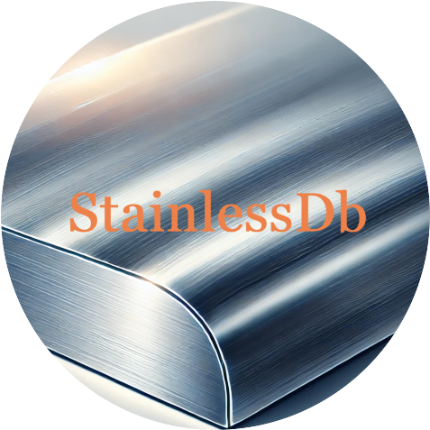

# StainlessDb
<p align="center">
  
</p>

## What is StainlessDb?
StainlessDb is an in-memory database system designed for lightweight

## Contents
- [Features](#features)
- [Documtentaion](#documentation)
- [Getting started](#getting-started)
- [Installation](#installation)
- [Contributing](#contributing)
- [License](#license)

## Features
### HTTP-Like Structure
StainlessDb adopts an HTTP-like structure, where requests and responses consist of a **header** and a **body**. The response also includes a **status code**, similar to HTTP responses. This makes the protocol familiar and easy to understand

### JSON-Based Commands
StainlessDb communicates with clients using JSON-formatted commands, making it simple and human-readable.
#### Request Command
Clients send requests in the following JSON format:
```json
{
    "header": {
        "command": "SET",
        "key": "key-name"
    },
    "body": "value"
}
```
#### Response Format
The server responds with a JSON object structured like this:
```json
{
    "statuscode": 200,
    "header": {
        "comment": "Command success"
    },
    "body": "Ok"
}
```

## Documentation
Detailed documentation is currently under development. Please check back later for more information on how to use and integrate StainlessDb.
## Getting started
Here is a series of basic operations to help you get started with StainlessDb.  
### 1. SET Command
The `SET` command stores a key-value pair in the database. In this example, we are storing the key `"rust"` with the value `"crab"`.  
#### Request
```json
{
    "header": {
        "command": "SET",
        "key": "rust"
    },
    "body": "crab"
}
```
#### Response
```json
{
    "statuscode": 204,
    "header": {
        "comment": "Command success"
    },
    "body": "OK"
}
```
The server responds with a 204 status code indicating that the command was successfully executed, but no content is returned in the body. The response confirms the success of the SET operation.  
### 2. GET Command
The GET command retrieves the value associated with a specified key. In this case, we are retrieving the value of the key "rust" that was set in the previous step.  
#### Request
```json
{
    "header": {
        "command": "GET",
        "key": "rust"
    },
    "body": null
}
```
#### Response
```json
{
    "statuscode": 200,
    "header": {
        "comment": "Get value"
    },
    "body": "crab"
}
```
The server responds with a 200 status code, indicating that the value was successfully retrieved. The value "crab" is returned in the body field.
### 3. DEL Command
The DEL command deletes a key-value pair from the database. Here, we are deleting the key "rust".
### Request
```json
{
    {
    "header": {
        "command": "DEl",
        "key": "rust"
    },
    "body": null
}
}
```
### Response
```json
{
    "statuscode": 200,
    "header": {
        "comment": "Command success"
    },
    "body": "OK"
}
```
The server responds with a 200 status code, confirming that the key-value pair was successfully deleted from the database.
## Installation
Installation instructions are currently being prepared. Please check back soon for details on how to install StainlessDb.
## Contributing
We welcome contributions! If you would like to contribute, please refer to the contributing guidelines.
## License
StainlessDb is licensed under the MIT License.
